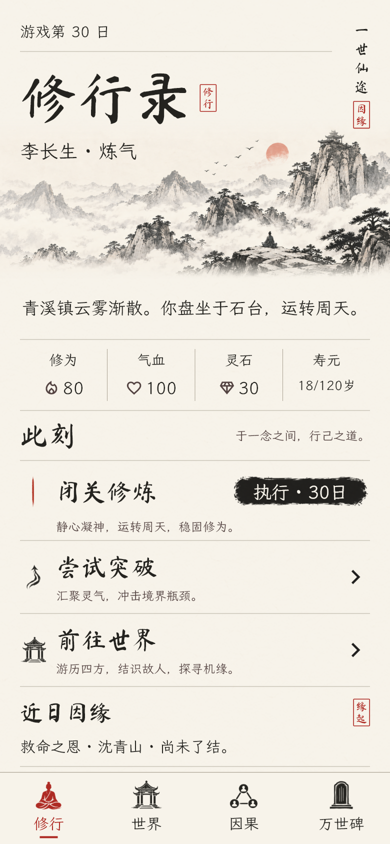
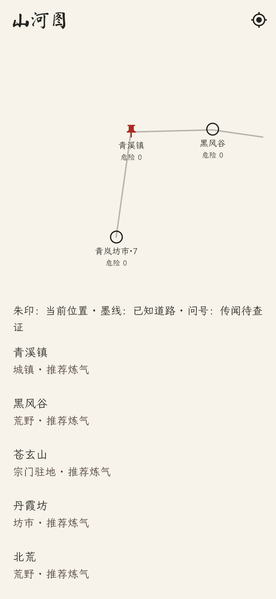
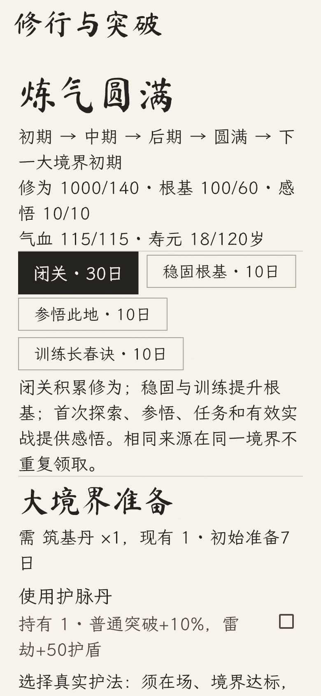

# 一世仙途

独立 Flutter 文字修仙应用（本地玩法＋可选 AI），Android / iOS。游戏时间只随行动推进；关闭应用后世界暂停。

## 朱印古卷界面

按用户选定的第三张设计稿重做原生界面：宣纸、水墨横幅、书法标题、朱砂印章、墨按钮与水墨导航。字体和图像随包离线使用；近日因缘仍由知识过滤后的真实关系生成。深浅主题、文字放大、命令与存档继续工作。



视觉对照及差异记录见 [design-qa.md](design-qa.md)。资源来源与字体许可证见 [assets/SOURCES.md](assets/SOURCES.md)。版本 1.2.0+5 加入大型山河地图与准备、历练型成长；保留手动检测模型、AI、奇遇、战斗与朱印图标。

## 山河与成长

「世界 → 山河图」查看已知州域，选择州后拖动、双指缩放，使用定位、搜索与类型筛选。详情列出已知资源、设施、危险与情报日期；传闻只显示待查证位置。购买州图、邻路调查、宗门情报和人物问路发现道路。规划使用已知道路的最短耗时路径，每次点「前进一段」只走一段；奇遇与战斗暂停行旅，关闭后保留剩余路线。金丹、元婴行旅分别减少30%、50%耗时，至少1日。

荒野和遗迹采集材料、积累感悟；坊市购买前三种基础突破材料，宗门委托与常驻挑战提供高阶材料。灵脉提高闭关收益，主修功法只使用所选流派；秘境每90日开放20日，三阶段探索可安全退出。高阶突破须抵达渡劫台，确认永久死亡风险后开始。

旧活动存档首次载入按原种子补充地图，保留世界、地点、位置、关系、历史与随机状态；原境界转为初期、根基30、感悟0，新增地点保持未知。旧人生档案不补造地图或成长记录。




## AI 与新增玩法

「世界」或「修行杂记」进入「天机设置」，填写 **HTTPS API 基础地址（例如带 `/v1` 的地址，不含 `/chat/completions`）**和自己的密钥，点击「检测模型」获取列表，搜索并选择模型，再保存设置。也可手动填写模型名称。检测调用 GET `/models`，无需先保存或启用 AI，不推进游戏时间、不产生文本生成请求；服务商不支持时提示手动填写。列表中的模型未必支持文字对话，可使用「测试连接」确认。支持 OpenAI 兼容 Chat Completions，不绑定服务商，也不内置开发者密钥。测试连接会产生一次请求；测试通过不代表服务商总能生成符合游戏规则的 JSON。

启用并同意发送相关背景后，探索与交谈自动调用。AI 世界事件另行开启，每 30 游戏日最多额外请求一次；可在生成期间取消，取消仍可能已产生费用。输入/输出 token 来自服务商返回的 usage，缺失时显示未知；不估算金额。密钥保存在移动端安全存储中，不进入存档、日志或 Actions。修改服务商域名时重新确认并填写对应密钥。

AI 只从规则生成的合法动作目录中选择效果。本地校验实体、知识、资源和因果来源后结算；30 秒超时、限流、拒绝、取消或非法内容均回退本地玩法，不自动重试。相同种子保证初始世界，本地动作可重放；首次 AI 文本不保证相同，历史重放使用保存的生成提案。

本地探索包括灵草、遗宝、救助、残碑、护送、遗器、伏击和灵泉八类奇遇；待处理时先选择或离开。人物可自由交谈，但言论不是客观事实，交易与结交仍使用正式行动。战斗提供攻击、流派技能、防御、药品和逃跑；强招提前预告，战斗灵力与突破修为分开。长春恢复、御剑强击、天机破招；装备采用独立实例，奇遇胜利可获得锋锐／坚韧／养气词条。

朱印「修」字图标由字体与确定性印章几何组成，iOS 全尺寸与 Android 自适应图标均已配置；`tool/create_icon.py` 可重建，许可证见资源说明。

## 运行

需要 Flutter 3.47 / Dart 3.13 或兼容版本、Android SDK 与 Java 17。iOS 构建需要 macOS / Xcode。

```sh
flutter pub get
flutter analyze
flutter test
flutter run
flutter build apk --debug --target-platform android-arm64
# 在 macOS 上验证
flutter build ios --no-codesign
```

本机 SDK 位于 `E:\codex project\ssh\.tools\flutter`，未加入 PATH。Windows 原生 hooks 对含空格路径敏感，可通过 `E:\CODEXP~1\ssh\TOOLS~1\flutter\bin\flutter.bat` 调用。依赖缓存位于 `E:\CODEXP~1\ssh\TOOLS~1\pub-cache`。本次构建所用 Android SDK 位于父工作目录的 `.tools/android-sdk`，完整 OpenJDK 17 安装在父工作目录 `.tools/jdk`。本机 JetBrains Runtime 缺少 jlink，不能完成 Android JNI 编译。以上路径仅用于当前机器，不写入应用配置。

`tool/check.ps1` 可执行依赖解析、静态分析与测试；`tool/build_android.ps1` 接受 Flutter、AndroidSdk、JavaHome 和 GradleCache 路径，构建 ARM64 调试安装包。Gradle 使用官方分发 URL 与固定 SHA-256 校验。

## GitHub Actions iOS 构建

仓库根目录的 `.github/workflows/xiuxian-ios.yml` 使用 macOS runner 和固定 Flutter 3.47.1。推送 `main` 分支中的游戏修改自动触发，也可在 Actions 的 **Xiuxian iOS** 页面手动选择分支执行。

工作流先执行锁文件依赖解析、静态分析和全部测试，再编译 iOS release 真机应用与 debug 模拟器应用。成功后下载 `xiuxian-ios-<commit>` artifact：`xiuxian-unsigned.ipa` 为未签名真机包，需另行签名才能安装到 iPhone；`xiuxian-simulator.zip` 可解压后通过 `xcrun simctl install booted Runner.app` 安装到已启动的 Mac iOS 模拟器。构建产物保留14天，不自动发布商店或 Release。

## 游玩

1. 输入道号与世界种子，创建一世。相同种子、生成版本和 NPC 数量生成相同初始关系。
2. 「世界」中可救助负伤修士（消耗回春丹）、结交、拜师、借款还款、立诺、结为道侣、调查、旅行或战斗。与他人反复结交会加深友谊，道侣需要强度60。NPC 也会自主修炼、入宗、迁移、经商和结交。
3. 「修行」进入境界准备：每境界初期、中期、后期、圆满，需要修为与根基逐次提升。闭关30日、稳固与参悟各10日；首次历练、遗迹、任务和师长指点提供防重复感悟。大突破需要对应材料、合适地点与健康气血；真实好友、师徒或同宗修士可护法。失败消耗材料并受伤，经过30日、恢复80%气血且稳固后解除。合体升大乘、大乘升渡劫分别承受3轮、5轮不可逃跑雷劫。
4. 探索可发现古碑奇遇；古碑有继续和放弃分支。加入宗门可推进三阶段委托，消耗灵草、丹药并获得报酬。
5. 「因果」提供玩家、人物和天下图谱：拖动、双指缩放、节点与连线详情、搜索、筛选、1–5跳展开、自动布局与长河追溯。默认80节点、480条边，渐进加载最多200节点；截断会明确提示。
6. 实际救助会建立有方向的救命之恩。受救 NPC 达到修炼和入宗条件后会成长；满足报恩条件时返回最后确认的恩人地点，遇见玩家后在妖潮事件中援助。该事件明确关联原救助事件，并向玩家告知相关成长经历。
7. 角色在战斗、突破或寿元耗尽时可能永久死亡。死亡后全部命令冻结，万世碑保存只读图谱、长河、未了结因果和人生评分。下一世生成独立世界。

## 数据与知识边界

- 纯 Dart 规则层写入实体、关系和事件；图谱只查询这些事实。没有产品演示关系或单独的图谱事实库。
- 关系支持方向、多重类型、强度、历史状态、继承来源和独立的偿还状态。死亡进入历史不会抹去已了结或未偿义务。
- 原因与影响显式存储。时间相邻不产生因果；未知来源不进入长河的因果链接。
- NPC 通过目击、调查、传闻、宗门情报、告知或推演获得信息。未经确认的传闻不触发已确认关系显示；秘密击杀不会直接给远方亲属完整凶手身份。
- 查询使用观察者知识快照。节点、搜索、关系、筛选、事件和统计均过滤未知信息；已知关系的远方秘密变化不会直接更新玩家视图。
- 本地单机保证应用界面查询不泄露秘密；不以此防止玩家直接修改或读取自己的存档文件。

## 存档与架构

`domain/` 是游戏规则与查询，`application/` 是 Riverpod 协调层，`data/` 是 Drift/SQLite 持久化，`ui/` 是 Flutter 原生界面。模拟在后台 isolate 执行；提交成功后发布新界面状态。

存档位于应用支持目录的 `xiuxian.sqlite`。世界元数据、实体、关系、事件、知识分别保存，关系端点和事件时间建立 SQL 索引。每个行动在单个事务中写入变化，失败时不发布或部分保存结果。schema v3 包含 v1/v2 的升级；历史世界拒绝覆盖。游戏随机状态、生成配置、事件序号与 NPC 批次游标均可恢复。

内容与规则版本3、初始世界生成版本2：9个境界各4阶段，默认12州×24地点（288处）、1200名 NPC。创角可调整世界规模；地图地形、道路、资源使用独立随机流。原五地点 ID 保留，生成连通道路及安全新手路线，八种突破材料均有常驻获取途径。NPC 使用根基、感悟、材料和地点条件成长，并依自身知识移动、购买和采集。尚未做长期数值平衡或商店发布准备。

## 验证

- 基础图谱、方向、多重关系、历史保留、秘密信息、知识快照、时间排序、种子复现与不可变命令测试。
- 动态 NPC、突破入宗、报恩、调查、复仇、悬赏、追杀、债务继承与任务分支测试。
- 实际 SQLite 事务回滚、恢复、迁移，以及完整因果链跨磁盘关闭重开、死亡封存与新一世隔离测试。
- 手机布局、主题、搜索筛选、节点与边点击、拖动、双指缩放和只读页面测试。视觉测试输出 `build/qa/karma-phone.png`；截图使用随包的文楷与书法字体。
- 5000 NPC、50000关系、100000事件规模测试；默认查询有节点与边上限。此为查询吞吐验证，不能替代 Android 实机60fps检查。

自动化验证包括地图连通与随机隔离、知识过滤、逐段收费及恢复、小阶段与失败伤势、真实护法、秘境、雷劫、NPC材料获取、寿元死亡和旧档案只读；固定种子真实流程完成跨州采集材料、三次小阶段提升、邀请护法、筑基与因果追溯。默认1200与压力5000 NPC 验证均包含受限地图查询；图谱另覆盖50000关系和100000事件。测试耗时不是手机帧率。

未连接 Android 实机；初版 iOS 已在 GitHub macOS runner / Xcode 26.6 编译通过，新版界面由独立仓库 Actions 再次构建。尚未执行 iPhone 实机验证。发布前仍需执行移动设备 profile、触控与生命周期验证，并配置正式签名。
