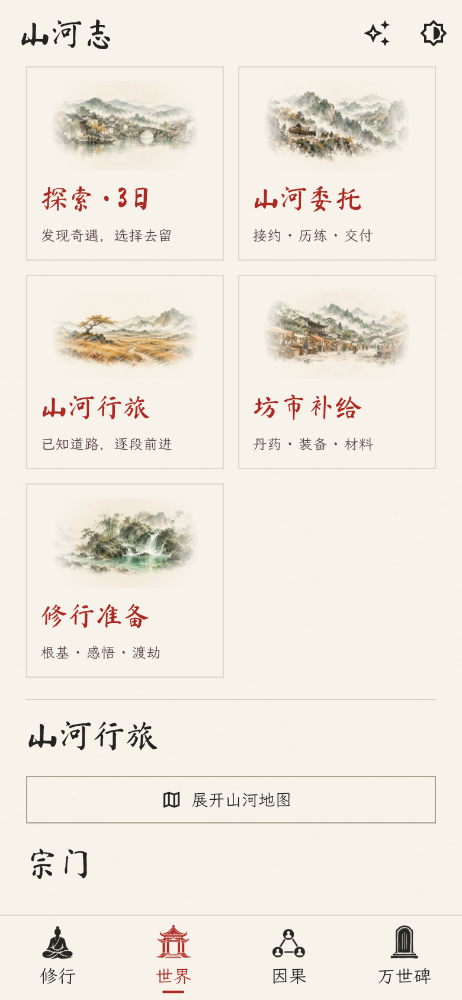
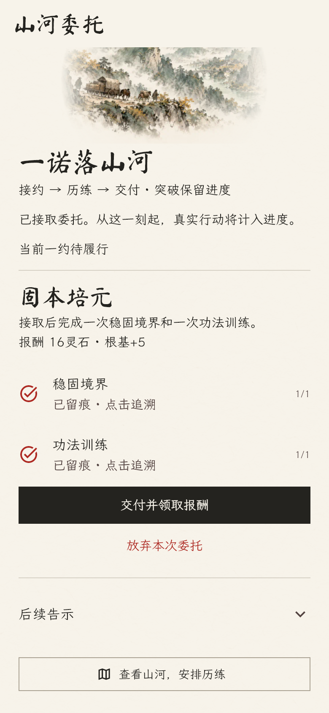
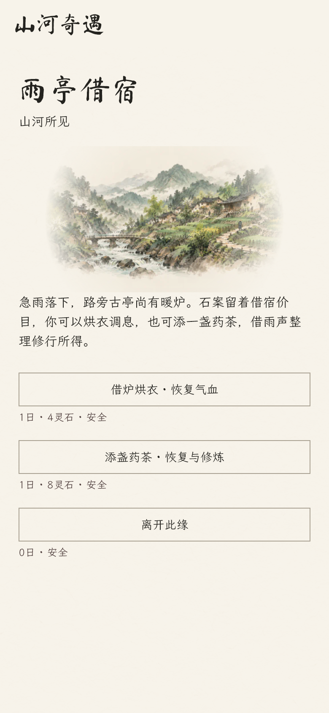

# 山河委托、短篇事件与天机叙事

版本：1.5.0+11；内容配置版本 6。日期：2026-10-09。

## 离线玩法优先

原八类奇遇仍可触发，新增四类短篇事件，每次保留两个有不同成本、收益的选择及安全离开。仅在玩家已确认的当前地点开放，实际耗时、资源和奖励由规则计算。

| 事件 | 场所条件 | 两条分支 |
| --- | --- | --- |
| 雨亭借宿 | 城镇、坊市、宗门驻地或荒野 | 4灵石恢复气血；8灵石恢复并获得修为 |
| 废窑寻材 | 有灵草的荒野或遗迹 | 拾取灵草；6灵石整理药窑，获得灵草和灵石 |
| 溪畔药圃 | 有灵草的河谷荒野 | 采成熟灵草；5灵石疏通药池，采药并疗伤 |
| 剑痕参悟 | 遗迹或宗门驻地 | 静观获得修为；8灵石激活残阵，修炼并恢复 |

非离开选择耗时1日，离开0日。收益复用现有境界约束：灵草3、气血最多恢复30（不超过上限）、修为20＋境界索引×5、灵石15＋境界索引×5。新事件保存发现→选择→实际结果的明确来源；选择完成后不可再次结算。地点、战斗和装备随机流不因事件发现额外改变。产品不注入演示关系或虚构人物。

## 山河委托

在已确认的城镇、坊市或宗门驻地接取、交付；同时履行一份，各类每大境界一次，放弃也占用次数。

| 委托 | 接取后的实际行动 | 交付和奖励 |
| --- | --- | --- |
| 寻访山河 | 抵达两个不同地点 | 18灵石、3根基 |
| 丹炉初试 | 采集灵草一次、炼制回春丹一次 | 交付回春丹1枚；22灵石、2根基 |
| 固本培元 | 稳固境界一次、功法训练一次 | 16灵石、5根基 |

根基不超过100。接取、交付、放弃均不额外推进时间；普通行动原耗时不变。只认实际成功行动的来源事件，不计算接取前行为、重复目标、NPC行为或死亡动作。突破后保留旧委托和固定报酬，完成记录不删除。进度、材料、报酬和事实同事务保存；旧存档缺少新字段时默认为空，不改历史或只读人生快照。

## 画面与减字

- 世界页以带离线水墨图的活动卡片进入探索、委托、行旅、补给与成长。奇遇、战斗、秘境待处理期间，普通推进动作禁用；仍可查看地图和委托。
- 当前委托前置，后续告示默认收起；缘由可展开，目标与报酬直接显示，来源可点击追溯。
- 修行页精简重复修辞，保留状态和行动入口。杂记默认显示三条近日见闻，完整历史进入分页因果长河；种子信息收起。
- 奇遇和近期长对白默认最多三行，随时展开原文；此前对白继续折叠，保存文本不裁剪。费用、耗时、资源不足和永久死亡风险不折叠。
- 深色主题、390像素手机布局及1.6倍文字已验证；书法标题提供楷体字形回退。

## API 创作建立在本地规则上

三种笔调：江湖纪实、诗意山水、轻快对白；简短篇幅默认开启，旧设置兼容。提示词版本2，简短奇遇建议60～110中文字、人物回答40～80字。服务商仍可能返回更长文本，界面折叠保留全文。

探索上下文包含当前合法选项目录与本地场景灵感、已接委托的可知进度、最近三个真实选择及沿明确因果来源找到的实际结果。AI 可原创题目与情境，选择不同合法选项组合；不能虚构任务完成、奖励发放或改变规则。上下文遍历有界，多回合交战后仍包含胜利与实际装备奖励。

交谈话题根据真实人物、共同确认地点与可知关系变化；仅附近、已知、存活 NPC 有话题。携带最近六轮言论，不能把言论当成客观事实。没有合适情报时不凭空创建关系或隐藏地点。

继续使用兼容 Chat Completions 的 model/messages/stream 请求，不引入供应商专用参数，不增加请求、付费重试或后台调用。结构、效果、实体、知识及前置条件校验不放宽；失败回退离线事件。密钥留在安全存储，设置和生成记录不含密钥。

## 验证依据

本轮新覆盖：委托领域及存储14项、本地事件13项、AI叙事9项、体验界面7项；原有地图、成长、死亡、导航、只读档案、连通性与规模测试继续执行。

发布前 `flutter analyze --no-pub` 无问题；`flutter test --no-pub --reporter expanded` 共179项全部通过。5,000 NPC／50,000关系／100,000事件的既有有界查询测试通过；这不能替代真实手机帧率验证。

- `commission_test.dart`：三个实际流程、防重复、跨境界续约、未知来源隔离、寿元死亡、只读档案和SQLite事务回滚。
- `local_event_expansion_test.dart`：四类事件经真实探索触发，八条分支实际结算，地点与传闻过滤、安全离开、余额不足、保存重放、随机流隔离及因果结果。
- `ai_narrative_gameplay_test.dart`：模拟HTTP请求验证偏好、知情隔离、已接委托与近期真实结果；完成“原创题目→新合法选项→本地结算”，非法奖励拒绝、不重试。
- `experience_ui_test.dart`：接约与领奖、设施入口、设置保存、行动锁、小屏深色大字体、近期对白展开及本地事件费用；生成截图后进行视觉检查。

AI 测试全程使用模拟接口，没有向真实服务商发送密钥或消耗付费 token。真实供应商与手机实测仍由 App 内配置和设备验证完成。iOS真机包与模拟器包由独立仓库的macOS Actions构建；未签名IPA仍需签名才能安装。
